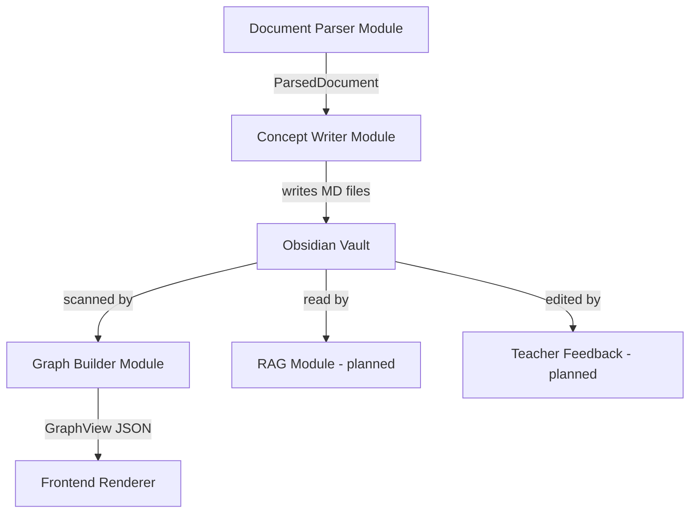

# Agent 架构说明 — LLM Wiki Approach

## 架构总览

本系统采用 **模块化管道 + Vault-as-State** 架构，而非传统的多 Agent 框架。



每个模块是独立的 Python 类，通过 Vault 文件系统通信。Vault 是全局共享状态。

## 设计决策论证

### 为什么不用多 Agent 框架（LangGraph/CrewAI）？

1. **5 小时约束**：框架学习成本 > 实际收益
2. **调试困难**：Agent 间的隐式通信难以追踪
3. **状态管理**：用文件系统做状态比 Agent memory 更透明
4. **可复现性**：每一步的输出都是人类可读的 MD 文件

### 为什么选择 Vault-as-State 而非传统数据库/内存？

| 方案 | 可调试性 | 人类可编辑 | Git 追踪 | 性能 |
|------|---------|-----------|---------|------|
| SQLite | 差 | 差 | 差 | 好 |
| 内存 JSON | 差 | 差 | 差 | 最好 |
| **MD Vault** | **最好** | **最好** | **最好** | 足够 |

对于 7 本教材 ≈ 1000 个概念文件的规模，文件系统扫描 < 100ms，性能不是瓶颈。

### 为什么图谱是派生的？

传统方案：Parser → Graph Schema → Store → Query → Render
本方案：Parser → MD Files → Scan Links → Render

减少了一层抽象，消除了 "图谱数据与概念描述不一致" 的 bug 类别。

## 数据流与调用链路

### 完整流程：上传 → 图谱展示

```
1. POST /api/documents/upload
   → PdfParser.parse(file) → ParsedDocument
   → RuntimeRepository.save_document(doc)
   → ConceptWriter.write_textbook_chapters(doc) → vault/textbooks/

2. POST /api/extraction/run
   → ConceptWriter.extract_and_write(doc)
     → for each chapter:
       → LLMClient.generate_json(prompt) → {concepts: [...]}
       → _write_concept(concept) → vault/concepts/{name}.md

3. GET /api/graph
   → GraphBuilder.build_graph_view()
     → scan vault/concepts/*.md
     → parse frontmatter → nodes[]
     → parse ## 关系 section → edges[]
     → return GraphView JSON

4. GET /api/graph/nodes/{name}
   → GraphBuilder.get_node_detail(name)
     → read vault/concepts/{name}.md
     → return {node: {...}, content_md: "..."}
```

### 关键接口

| 接口 | 输入 | 输出 |
|------|------|------|
| `PdfParser.parse()` | file path | ParsedDocument |
| `ConceptWriter.extract_and_write()` | ParsedDocument | list[vault_path] |
| `GraphBuilder.build_graph_view()` | (reads vault) | GraphView JSON |
| `VaultService.read_page()` | relative_path | VaultPage |

## Prompt 工程

### 知识抽取 Prompt 设计

```
System: 你是教材知识图谱抽取器。只从给定章节正文抽取知识...
User: 教材: {title}, 章节: {chapter_title}, 正文: {content[:8000]}
```

约束：
- 输出必须是 JSON（`{"concepts": [...]}`）
- 每章 8-15 个概念
- relations.type 限定 4 种
- evidence 必须是原文引用
- confidence 0.0-1.0

防幻觉策略：
- System prompt 明确"不使用外部知识"
- evidence 字段要求直接引用
- confidence < 0.7 的概念在整合阶段优先删除

## 取舍与权衡

### 放弃的方案

1. **GraphDB (Neo4j)**: 对 hackathon 规模过重，部署复杂
2. **Vector DB for graph**: 知识图谱的拓扑结构用向量表示不合适
3. **LangGraph multi-agent**: 调试周期太长，5 小时内无法稳定
4. **前端实时协同编辑**: scope 过大

### 已知局限

1. **概念去重**：当前依赖 LLM 输出的 name 规范化，同一概念不同表述可能生成多个文件
2. **大规模性能**：1000+ 概念文件时，每次 GET /api/graph 都全量扫描。可通过缓存优化
3. **并发写入**：多个 extraction job 同时写入 vault 可能产生文件冲突
4. **关系类型有限**：只支持 4 种关系类型，复杂知识结构可能需要扩展

### 改进方向（给更多时间）

1. **Embedding 对齐**：对 vault/concepts/ 中的文件做 embedding，自动发现语义重复
2. **增量图谱更新**：只扫描修改过的文件，而非全量
3. **Obsidian Plugin**：开发一个 Obsidian 插件直接与后端交互
4. **Git-based versioning**：vault 本身用 git 管理，支持回滚整合决策

## 创新点

1. **Vault-as-State 架构**：知识库即文件系统，无中间抽象层
2. **派生式图谱**：从 wikilinks 实时构建，永远与内容一致
3. **Obsidian 兼容**：data/vault/ 可直接作为 Obsidian vault 打开
4. **JSON 信封 + MD 载荷**：API 满足赛题 JSON 要求，同时内容是 human-readable markdown
