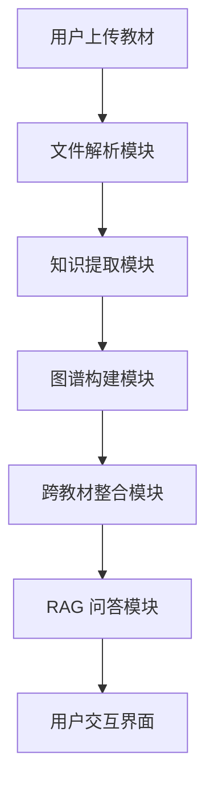

# AI 全栈极速黑客松·赛题文档

## 学科知识整合智能体开发

开发一个 AI 智能体，对多本教材进行知识整合：构建可视化知识图谱 | 跨教材去重提纯 | RAG 精准问答 | 自主设计 Agent 架构

比赛时长：5 小时

## 1 赛题背景

在当前高校教学体系中，同一学科领域往往存在多本教材并行使用的现象。这些教材由不同出版社出版、不同作者编写，虽然各有侧重，但彼此之间存在大量的内容重复。以计算机科学为例，“数据结构与算法”这门课可能有七八本主流教材，其中关于“排序算法”的章节在每本书中都会出现，讲解内容高度雷同，但表述方式和组织逻辑各不相同。

这种冗余对学生、教师和教学管理者都带来了实际困扰：学生大量时间浪费在重复阅读上，教师难以系统评估教材间的交叉与缺失，教学管理者缺乏数据驱动的课程整合依据。

你的任务：用 AI 帮教师把 7 本教材变成不到 2.1 本的精华，而且变完之后教学效果不打折。

## 2 任务目标

开发一个学科知识整合智能体，它能够：

1. 自动加载多本教材（多格式支持）
2. 为每本教材构建知识图谱并可视化
3. 跨教材识别知识点的重叠、互补与缺失
4. 将多本教材的内容整合压缩到不超过原始体量 30% 的精华版本
5. 基于整合后的知识库进行 RAG 精准问答（必须引用原文来源）
6. 自主设计 Agent 架构并提交架构说明文档
7. 通过与学科教师的多轮对话，迭代优化整合方案

## 3 功能要求

### 3.1 必须实现的功能（P0）

### （1）多格式教材加载与解析

系统需要支持加载多种格式的教材文件，解析后统一转化为结构化数据。

具体要求：

- 支持的格式：PDF（必须）、Markdown（必须）、TXT（必须）、Word .docx（建议）、Excel（可选）
- 前端提供文件上传区域，支持拖拽上传和点击选择，支持批量上传多个文件
- 上传后显示文件列表，包含：文件名、格式、大小、解析状态（解析中/已完成/失败）
- 解析后的统一输出结构：

```json
{
  "textbook_id": "book_01",
  "filename": "生理学.pdf",
  "title": "生理学",
  "total_pages": 520,
  "total_chars": 385000,
  "chapters": [
    {
      "chapter_id": "ch_01",
      "title": "第一章绪论",
      "page_start": 1,
      "page_end": 15,
      "content": "生理学是研究生物体正常生命活动规律的科学...",
      "char_count": 8500
    }
  ]
}
```

- PDF 解析需要处理的问题：章节标题识别（通过字体大小、加粗或正则匹配“第 X 章”）、页眉页脚过滤、图表区域跳过
- 大文件处理：逐页解析，不要一次性把整本书加载到内存。

验收标准：上传一本 PDF 教材后，系统能正确识别出章节结构并显示在前端。

### （2）单本教材知识图谱构建与可视化

为每本教材分别构建知识图谱并以可视化形式展示。

具体要求：

- 对每个章节调用 LLM，提取该章节中的核心知识点（概念、定理、方法、现象等）
- 每个知识点需要结构化输出：

```json
{
  "id": "node_001",
  "name": "动作电位",
  "definition": "细胞受到刺激后，膜电位发生的一次快速而可逆的倒转...",
  "category": "核心概念",
  "chapter": "第二章细胞的基本功能",
  "page": 35
}
```

- 识别知识点之间的关系，关系类型至少包含以下四种中的三种：

| 关系类型 | 说明 | 示例 |
| --- | --- | --- |
| 前置依赖（prerequisite） | 学习 B 之前必须先掌握 A | “动作电位”依赖“静息电位” |
| 并列关系（parallel） | 同一层级的平行概念 | “有丝分裂”与“减数分裂” |
| 包含关系（contains） | 上位概念与下位概念 | “免疫系统”包含“T 细胞” |
| 应用关系（applies_to） | 某知识点是另一个的应用场景 | “抗体”应用于“体液免疫” |

- 关系的输出结构：

```json
{
  "source": "node_001",
  "target": "node_002",
  "relation_type": "prerequisite",
  "description": "理解动作电位需要先掌握静息电位的概念"
}
```

- LLM 调用时的 Prompt 设计建议：明确要求输出 JSON 格式，给出 few-shot 示例，限制每次调用只处理一个章节（避免上下文过长）

验收标准：选择一本教材后，系统能生成该教材的知识图谱数据（JSON 格式的节点和边列表），并在前端以可视化形式展示。

### （3）知识图谱交互

知识图谱需要支持用户交互操作，不能只是一张静态图片。

具体要求：

- 节点点击：点击任意节点，弹出或侧边展示该知识点的详细信息（名称、定义、所在章节、原文出处）
- 频次可视化：当加载多本教材后，节点大小或颜色深度应反映该知识点在多本教材中出现的频次（出现次数越多 → 节点越大或颜色越深）
- 教材来源区分：不同教材来源的知识点用不同颜色标识
- 基本交互：支持鼠标滚轮缩放、拖拽移动画布、拖拽移动单个节点
- 搜索（建议实现）：输入关键词搜索知识点，高亮匹配的节点

推荐技术方案：D3.js 力导向图、ECharts 关系图、Cytoscape.js、AntV G6。选一个即可。

验收标准：知识图谱能在浏览器中渲染，点击节点能看到详细信息，能通过视觉元素区分不同教材和频次。

### （4）跨教材知识图谱整合（核心难点）

将多本教材的知识图谱合并，去重提纯，这是本赛题最核心的技术挑战。

具体要求：

- 语义对齐：识别不同教材中描述同一概念的知识点，即使措辞不同。例如“白细胞”和“白 blood 细胞”和“leukocyte”应该被识别为同一知识点
- 对齐算法至少包含一种：
  - 文本嵌入（Embedding）计算语义相似度，设定阈值判断是否为同一知识点
  - LLM 判断两个知识点是否等价（更准确但更贵）
  - 两种结合（推荐）
- 整合决策：对于被识别为重复的知识点，系统需要做出决策：

```json
{
  "decision_id": "merge_001",
  "action": "merge",
  "affected_nodes": [
    "book01_node_015",
    "book03_node_032",
    "book05_node_008"
  ],
  "result_node": "merged_node_001",
  "reason": "三本教材都讲解了'炎症'的概念，保留《病理学》的版本因其描述最系统完整",
  "confidence": 0.92
}
```

- 决策类型包括：merge（合并重复）、keep（保留唯一）、remove（删除冗余）
- 压缩比控制：整合后保留的内容总字数不超过原始总字数的 30%。系统需要在前端展示压缩比统计（原始总字数 → 整合后字数 → 压缩比百分比）
- 可视化对比（建议实现）：展示整合前后的知识图谱对比，让用户直观看到哪些节点被合并、哪些被删除

验收标准：加载 2 本以上教材后，系统能自动识别重复知识点，执行整合，输出整合决策列表，压缩比不超过 30%。

### （5）RAG 精准问答

系统必须实现基于教材内容的 RAG（Retrieval-Augmented Generation）问答功能。这不是普通的聊天机器人，而是要求每一个回答都有据可查。

完整 RAG Pipeline 要求：

#### 第一步·文档分块（Chunking）：

- 将每本教材的正文拆分为小块（chunk），每块约 500-800 字
- 相邻块之间有 50-100 字的重叠（sliding window），防止知识点被截断
- 每个 chunk 必须保留元数据：教材名称、章节标题、起始页码
- 在文档中说明你选择这个分块粒度的理由

#### 第二步·向量嵌入（Embedding）：

- 将每个 chunk 转化为向量表示
- 推荐使用：sentence-transformers（本地运行，免费）或 OpenAI Embedding API
- 如果使用中文教材，建议选择支持中文的模型（如 paraphrase-multilingual-MiniLM-L12-v2 或 BGE-small-zh）

#### 第三步·向量存储与检索：

- 将所有 chunk 的向量存入向量数据库（推荐 FAISS 或 ChromaDB，轻量级）
- 用户提问时，将问题转为向量，检索 top-5 最相关的 chunk
- （加分）可选实现混合检索：向量检索 + BM25 关键词检索，取并集后重排序

#### 第四步·生成回答：

- 将检索到的 top-5 chunk 作为上下文注入 LLM prompt
- Prompt 必须包含以下约束：
  - 只基于提供的上下文回答，不使用自身知识
  - 每个回答附带来源引用，格式为 [教材名称, 第 X 章, 第 X 页]
  - 如果上下文中找不到答案，回复“当前知识库中未找到相关信息”

前端界面要求：

- 提供问答输入框，用户输入问题后获得回答
- 回答区域展示：回答正文 + 引用来源列表
- 每条引用显示：教材名、章节、页码、相关度分数
- 点击引用可展开查看原文 chunk 内容
- 界面上方显示索引状态（已索引 X 本教材，共 X 个知识块）

API 接口设计参考：

- `POST /api/rag/index` → 对已上传教材建立向量索引
- `POST /api/rag/query` → 输入问题，返回带引用的回答
- `GET /api/rag/status` → 查询索引状态

返回数据结构：

```json
{
  "answer": "炎症是机体对致炎因子的损伤所发生的防御性反应...",
  "citations": [
    {
      "textbook": "病理学",
      "chapter": "第四章炎症",
      "page": 78,
      "relevance_score": 0.92
    },
    {
      "textbook": "生理学",
      "chapter": "第九章免疫",
      "page": 302,
      "relevance_score": 0.85
    }
  ],
  "source_chunks": [
    "炎症(inflammation)是具有血管系统的活体组织对各种损伤因子的刺激...",
    "机体免疫系统在炎症反应中发挥重要作用..."
  ]
}
```

验收标准：上传教材 → 建立索引 → 输入问题 → 获得带引用来源的回答，引用的教材和章节与问题内容相关。

鼓励自建 RAG Benchmark：

我们强烈鼓励选手在开发过程中自行构建更完整的 RAG 评测集，用数据驱动的方式优化你的 RAG pipeline。这本身就是 AI 工程能力的重要体现。

你可以做的事情包括但不限于：

- 自己利用 AI 编写 20-50 个测试问题，覆盖不同难度和类型（事实性/比较性/推理性/跨教材）
- 为每个问题标注预期答案和预期引用来源（ground truth）
- 跑自动化评测，统计回答准确率、引用准确率、平均响应时间、Token 消耗
- 对比不同分块策略（300 字 vs 500 字 vs 800 字）、不同 embedding 模型、有无 rerank 的效果差异
- 将评测结果整理成表格或图表，写入 `docs/Agent 架构说明.md` 或 P2 技术报告中

有 benchmark 数据支撑的 RAG 设计，在架构评分维度（25 分）中会获得显著更高的评分，并且会在 P2 技术报告中拿到更高的分。

### （6）Agent 架构设计与说明文档

选手需要自主设计系统的 Agent 架构，并提交一份 `docs/Agent 架构说明.md` 文档。这不是一道有标准答案的题目。你可以用单 Agent 跑通所有功能，也可以设计多 Agent 协作系统——关键是你的设计决策必须有充分的理由。

架构说明文档必须包含以下内容：

#### a) 架构总览

- 你的系统有几个 Agent（或模块）？各自负责什么？
- 用一段话或一张图说清楚整体架构
- 建议使用 Mermaid 语法画架构图，例如：



#### b) 设计决策论证

- 为什么选择这种架构？解决了什么问题？
- 如果是单 Agent：为什么不拆分？你如何管理 prompt 的复杂度和上下文长度？
- 如果是多 Agent：为什么要拆？每个 Agent 的职责边界如何划定？Agent 之间如何通信和协调？

#### c) 数据流与调用链路

- 一次完整的“上传教材 → 构建图谱 → 整合 → 问答”流程中，数据如何在各模块/Agent 之间流转？
- 关键接口的输入输出是什么？

#### d) 取舍与权衡

- 你在设计过程中放弃了哪些方案？为什么？
- 你的架构有什么已知局限？如果给你更多时间你会怎么改进？

评分不看 Agent 数量，看设计决策的合理性和论证深度。一个论证充分的单 Agent 方案可以比一个没想清楚就硬拆的三 Agent 方案得分更高。

### （7）整合建议与多轮对话

系统需要对整合决策提供解释，并支持教师通过对话修改整合方案。

具体要求：

- 系统对每一项整合决策给出理由（为什么合并这几个知识点、为什么删除这个知识点）
- 提供聊天界面，教师可以用自然语言跟系统对话，例如：
  - “为什么把《生理学》里的‘炎症’和《病理学》里的‘炎症反应’合并了？”
  - “我觉得‘免疫应答’不应该被删除，请保留”
  - “把‘抗原’和‘免疫原’分开，它们不是同一个概念”
- 系统根据教师反馈调整整合结果，并在知识图谱中实时更新
- 对话历史需要持久化（至少在同一个会话中保留上下文）

验收标准：教师能通过对话修改至少一项整合决策，系统调整后在图谱或整合结果中反映出变化。

### （8）Web 交互界面

整个系统采用 Web 前端，用户通过浏览器即可使用全部功能。

具体要求：

- 单页应用（SPA），所有功能在一个页面内通过 Tab 或区域划分完成
- 建议的界面布局：
  - 左侧：教材管理区（上传、列表、状态）
  - 中间：知识图谱可视化区（最大面积，这是核心展示区）
  - 右侧：功能面板（Tab 切换：整合操作 / RAG 问答 / 对话 / 报告）
- 响应式设计不做强制要求，但页面在 1920×1080 分辨率下应正常显示
- UI 框架不限（React / Vue / 原生 HTML+JS 均可）

验收标准：打开浏览器能看到完整的功能界面，所有功能模块可操作。

### （9）整合报告

以赛方提供的 7 本教材为例，输出一份完整的整合报告。

报告内容要求：

- 整合概览：原始教材数量、总字数、整合后字数、压缩比
- 整合决策摘要：共做了多少项整合决策（合并 X 项、保留 X 项、删除 X 项）
- 知识图谱统计：整合前总节点数 → 整合后节点数，关系数变化
- 重点整合案例：列举 3-5 个典型的整合决策，说明为什么这么做
- 教学完整性说明：整合后是否有知识缺口？如何保证教学逻辑链路不断裂？

报告格式：Markdown 文件，存放于 `report/整合报告.md`

验收标准：报告完整涵盖以上五项内容，数据与系统实际运行结果一致。

### （10）开发文档

提供完整的开发文档，确保其他开发者能够根据文档独立部署和运行系统。

文档清单：

| 文档 | 路径 | 核心内容 |
| --- | --- | --- |
| 需求分析 | `docs/需求分析.md` | 子问题分解：知识点粒度定义、重复判定标准、教学连贯性保障、压缩比计算方式、RAG 分块策略选择依据 |
| 系统设计 | `docs/系统设计.md` | 系统架构图、数据流、各层技术选型及理由、API 接口一览 |
| Agent 架构说明 | `docs/Agent 架构说明.md` | 架构总览、设计决策论证、数据流、取舍与权衡（详见第 6 项要求） |
| README | `README.md` | 项目简介、环境依赖（Python 版本、Node 版本）、安装步骤（pip install / npm install）、配置说明（.env 文件）、启动命令、使用说明 |

验收标准：另一个开发者拿到你的仓库，按照 README 操作，能在本地成功运行系统。

### 3.2 加分项（P1）

以下功能不做硬性要求，但实现后会获得额外加分。列表仅为参考方向，鼓励选手根据自己的技术特长自由发挥——任何能提升系统功能、性能或体验的改进都可以获得加分，不限于以下列举：

- 知识图谱支持多种视图切换（力导向图 / 树状图 / 矩阵热力图 / 桑基图）
- 用户可在图谱上直接拖拽操作整合决策
- 混合检索（向量 + BM25）+ Rerank 二次排序
- Token 消耗统计与可视化
- 支持本地部署开源模型（Ollama 等）
- 整合报告导出为 PDF
- Docker 一键部署
- 自建 RAG Benchmark 并用数据驱动优化检索效果
- 以及任何你认为有价值的创新功能或优化——只要在 `docs/Agent 架构说明.md` 中说明你做了什么、为什么做、效果如何

### 3.3 挑战加分项（P2 · 附加分）

适用对象：完成全部 P1 功能后仍有余力的选手。

你可以额外提交一份技术报告（飞书文档链接，通过提交表单提交），论证你在系统中采用的某项技术方案如何提升了 AI 的性能或效果。

P2 不限于多 Agent 架构。任何能够提升系统 AI 性能的技术方案都可以作为 P2 的主题，包括但不限于：

- 多 Agent 协作架构设计与优势论证
- RAG 检索策略优化（分块策略对比、混合检索、Rerank 等）
- Prompt 工程优化（不同 prompt 模板对知识提取质量的影响）
- 知识图谱对齐算法改进（不同相似度阈值、不同 embedding 模型的对比）
- 压缩策略优化（如何在保证教学完整性的前提下最大化压缩比）
- 性能优化（并发处理、缓存策略、Token 消耗优化等）
- 或者任何你认为有价值的技术改进

核心要求：无论你选择什么主题，必须有实验数据来验证你的方案确实有效。没有实验支撑的纯理论论述不会获得高分。

这份文档的定位类似一篇小型技术论文（3000-8000 字），用科研级别的严谨思维论证你的技术方案的优势。

文档结构建议（不强制，但高质量的报告通常包含以下内容）

#### 1. 摘要（Abstract）

- 一段话概括你的技术方案和核心发现

#### 2. 问题分析（Problem Statement）

- 你要解决的是什么具体问题？
- 现有方案（或基线方案）存在什么瓶颈？
- 用具体数据或案例说明问题，而不是泛泛而谈

#### 3. 方案设计（Proposed Approach）

- 你提出的改进方案是什么？
- 技术细节：具体的算法、架构、参数选择
- 附架构图或流程图

#### 4. 实验与结果（Experiments & Results）

- 这是最核心的章节，必须有量化数据
- 实验设计：基线方案是什么？对比了哪些变量？
- 评估指标：用什么指标衡量效果（准确率、响应时间、Token 消耗、压缩比等）
- 实验结果：用表格或图表呈现数据
- 结论：数据说明了什么？你的方案在什么条件下有效/无效？
- 期望的实验示例：
  - RAG 优化：不同分块大小（200/500/800/1200 字）的检索命中率对比
  - 多 Agent：单 Agent vs 多 Agent 的输出质量、Token 消耗、错误隔离对比
  - Prompt 优化：不同 prompt 模板提取知识点的准确率对比
  - 对齐算法：不同相似度阈值下的知识点匹配准确率和召回率
- 有实验数据支撑的论证会获得显著更高的评分

#### 5. 局限性与未来方向（Limitations & Future Work）

- 你的方案有什么已知局限？
- 如果给你更多时间/资源，你会如何改进？

#### 6. 参考（References）

- 引用的论文、开源项目、技术博客（如果有的话）

评分说明：

- 此项为附加分，直接加在总分（100 分）之上
- 评委根据文档的论证深度、实验严谨性、工程洞察力综合打分
- 参考评分区间：
  - +2~3 分：有完整的架构说明和基本的优势对比，但缺少实验数据
  - +3~5 分：有清晰的架构设计，有对比实验数据支撑优势论证，论证逻辑自洽
  - +5~15 分：达到技术博客/会议分享级别的质量，有严谨的实验设计、量化对比、深入的工程洞察
  - +15 分以上：达到学术论文级别的严谨度，有创新性的架构设计思路，论证无明显漏洞，能给评委带来新的认知
- 没有提交此文档不扣分，不影响基础 100 分的评审
- 提交了但质量不高也不扣分，最低 +0 分

## 4 提交要求

### 4.1 提交物

每位参赛者必须提交以下两项，缺一不可：

| 提交项 | 要求 | 说明 |
| --- | --- | --- |
| GitHub 仓库链接 | 公开可访问（Public） | 包含全部源代码和文档 |
| 在线部署链接 | 能在浏览器中打开并正常使用 | 部署到魔搭创空间或其他公网可访问平台 |

未同时提交以上两项的作品视为未完成，不进入评审流程。

### 4.2 仓库结构规范

```text
你的项目/
├── .gitignore              # 必须排除教材 PDF 文件（见下方说明）
├── README.md               # 项目说明（必须包含：环境依赖、安装步骤、配置说明、运行命令）
├── docs/
│   ├── 需求分析.md          # 问题分解与子问题分析
│   ├── 系统设计.md          # 架构设计、数据流、技术选型
│   ├── Agent架构说明.md     # Agent 架构设计决策与论证（核心评分文档）
│   └── 接口文档.md          # API 接口定义（可选）
├── src/                    # 源代码（前后端分离或合并均可）
├── report/
│   └── 整合报告.md          # 以 7 本教材为例的整合报告
├── requirements.txt        # Python 依赖（如使用 Python）
├── package.json            # 前端依赖（如使用 Node.js）
└── docker-compose.yml      # 容器化部署配置（加分项）
```

重要：不要将教材 PDF 文件推送到 GitHub 仓库。7 本教材总计约 826MB，GitHub 单文件限制 100MB，推送会失败。请在 `.gitignore` 中添加：

```gitignore
# 教材数据（不上传到GitHub）
data/textbooks/*.pdf
*.pdf
```

教材文件由赛方单独提供，评审时会使用赛方的教材数据测试你的系统。你的代码应支持用户在前端上传教材文件，而不是依赖仓库内的固定文件。

### 4.3 提交方式

通过赛事提交表单填写：姓名、学号、GitHub 仓库链接、部署链接。P2 挑战加分项的技术报告通过飞书文档链接提交（选填）。

### 4.4 提交时间

- 必交项（GitHub 仓库链接 + 部署链接）：鼓励尽早提交。提前提交不影响你继续更新代码——评审以截止时间前的最后一次 git commit 为准。早交晚交不影响评分，但早交可以帮你确认提交流程没有问题。
- 选交项（P2 技术报告飞书文档）：可以在比赛结束后 24 小时内补交。写技术报告需要完整的实验数据和深入思考，给你多一点时间打磨。
- 所有代码评审以截止时间前的最后一次 git commit 为准，截止后的 commit 不计入评审。

## 5 评分标准

满分 100 分，分为六个维度。

### 5.1 A. 文档完整性与可复现性（15 分）

| 子项 | 基础分 | 进阶分 | 考察要点 |
| --- | --- | --- | --- |
| README 可复现性 | 3 | +1 | 基础：有依赖、步骤、配置、运行命令。进阶：有 Docker 一键部署 |
| 需求分析文档 | 3 | +1 | 基础：覆盖粒度、重复判定、压缩比。进阶：有 RAG 分块依据 |
| 系统设计文档 | 3 | +1 | 基础：有架构、数据流、选型。进阶：有 API 请求/响应示例 |
| 整合报告 | 2 | +1 | 基础：有决策摘要和压缩比。进阶：有教学完整性分析 |

### 5.2 B. 功能实现完整度（25 分）

| 子项 | 基础分 | 进阶分 | 考察要点 |
| --- | --- | --- | --- |
| 多格式文件解析 | 2 | +1 | 基础：PDF/MD/TXT 三种。进阶：额外支持 DOCX/Excel + 错误处理 |
| 知识点提取与图谱构建 | 4 | +1 | 基础：有 LLM 提取 + schema + 关系 ≥3 种。进阶：有 few-shot 示例 |
| 知识图谱交互 | 3 | +1 | 基础：点击详情 + 频次可视化 + 缩放拖拽。进阶：有搜索/筛选 |
| 跨教材整合算法 | 5 | +1 | 基础：有语义对齐 + 整合决策 + 30% 压缩。进阶：双重对齐 + 可视化对比 |
| RAG 问答功能 | 4 | +1 | 基础：完整 pipeline + 带引用。进阶：混合检索或 Rerank + 自建 benchmark |
| 多轮对话与迭代 | 2 | +1 | 基础：有对话 + 历史。进阶：反馈能修改决策并更新图谱 |

### 5.3 C. 知识图谱可视化创新性（13 分）

| 子项 | 基础分 | 进阶分 | 考察要点 |
| --- | --- | --- | --- |
| 视觉实现 | 3 | +1 | 基础：有专业可视化库 + 颜色大小映射。进阶：多维度叠加，层次丰富 |
| 交互功能 | 3 | +1 | 基础：点击 + 缩放拖拽。进阶：搜索/筛选/悬停等多种交互 |
| 创新元素 | 0 | +5 | 纯进阶分：多视图切换 / 桑基图 / 时间轴 / 拖拽整合 / 矩阵热力图等 |

### 5.4 D. Agent 架构设计（20 分）

本维度评审 `docs/Agent 架构说明.md` 文档的质量，不看 Agent 数量，看设计决策的合理性和论证深度。

| 子项 | 基础分 | 进阶分 | 考察要点 |
| --- | --- | --- | --- |
| 架构总览与清晰度 | 3 | +1 | 基础：有架构描述，职责清晰。进阶：有 mermaid 架构图 + 接口定义 |
| 设计决策论证 | 5 | +2 | 基础：有“为什么”的论证。进阶：讨论替代方案 + 量化数据支撑 |
| RAG Pipeline 设计 | 4 | +1 | 基础：有分块 + embedding + 检索说明。进阶：有量化对比实验 |
| Prompt 工程 | 2 | +1 | 基础：有格式约束。进阶：有 few-shot + 防幻觉策略 |
| 已知局限与改进 | 1 | +1 | 基础：有提及。进阶：深入讨论 + 具体改进方案 |

基础满分：15 / 进阶满分：20

评分指引：

- 16-20 分：架构论证深入，有清晰的设计理由和取舍分析，RAG pipeline 设计合理
- 12-15 分：有完整的架构说明，设计决策基本合理，但论证不够深入
- 8-11 分：有架构文档但内容浅薄，只描述了“做了什么”
- 4-7 分：架构文档不完整，或设计决策明显不合理
- 0-3 分：没有提交架构说明文档

### 5.5 E. 代码质量与工程规范（17 分）

| 子项 | 基础分 | 进阶分 | 考察要点 |
| --- | --- | --- | --- |
| 项目结构 | 3 | +1 | 基础：前后端分离，目录清晰。进阶：模块化彻底，命名统一 |
| 依赖管理 | 2 | +1 | 基础：有 requirements.txt/package.json。进阶：版本锁定 + .env.example |
| 代码规范 | 3 | +1 | 基础：有注释，函数拆分合理。进阶：类型注解 + 错误处理完善 |
| 部署配置 | 2 | +1 | 基础：有部署脚本。进阶：Docker/docker-compose 一键部署 |

基础满分：10 / 进阶满分：17（注：部分选手 P0 做得扎实也能自然达到进阶标准）

### 5.6 F. 创新与自由发挥（10 分）

此维度评估选手在 P0 和 P1 标准要求之外的额外创新。不设固定清单，鼓励选手根据自身技术特长自由发挥。

创新类型包括但不限于：

- 功能创新：实现了赛题未要求的功能（如自动生成教学大纲、知识点难度评估、学习路径推荐等）
- 技术创新：使用了独特的技术方案（如自定义图谱对齐算法、创新的 RAG 优化策略等）
- 工程创新：在工程实践上有突出表现（如自动化测试、性能监控、CI/CD 等）
- 体验创新：在用户体验上有超出预期的设计（如引导式操作流程、数据导入导出等）

| 分数区间 | 标准 |
| --- | --- |
| 8-10 | 有多项明确的创新，在文档中清晰说明了设计理由和效果 |
| 5-7 | 有 1-2 项明确的创新，有一定说明 |
| 2-4 | 有微小的额外功能或优化，但不够突出 |
| 0-1 | 没有超出标准要求的内容 |

要求：在 `docs/Agent 架构说明.md` 中用独立章节说明你的创新点——做了什么、为什么做、效果如何。没有说明的创新不计分。

各维度汇总：

| 维度 | 基础满分（P0） | 进阶满分（含 P1） | 总满分 |
| --- | --- | --- | --- |
| A 文档 | 11 | 15 | 15 |
| B 功能 | 20 | 25 | 25 |
| C 可视化 | 6 | 13 | 13 |
| D 架构 | 15 | 20 | 20 |
| E 代码 | 10 | 17 | 17 |
| F 创新 | - | - | 10 |
| 合计 | 62 | 90 | 100 |

## 6 赛方提供的资源

### 6.1 测试教材

赛方提供 7 本教材文件作为实际测试数据（比赛开始时发放），选手必须以这 7 本教材为例输出整合报告。

## 7 技术建议（仅供参考，不做强制）

| 层级 | 推荐技术 |
| --- | --- |
| 后端框架 | FastAPI (Python) |
| 前端框架 | React / Vue 3 |
| 知识图谱可视化 | D3.js / ECharts / Cytoscape.js / AntV G6 |
| 大模型调用 | 通义千问 API / DeepSeek API / Claude API / OpenAI API |
| 向量嵌入 | sentence-transformers / OpenAI Embedding / BGE |
| 向量检索 | FAISS / ChromaDB / Qdrant |
| Agent 框架 | LangGraph / CrewAI / AutoGen（可选，也可手动编排） |
| 文件解析 | PyMuPDF / python-docx / pandas |
| 部署 | 魔搭创空间（免费 CPU，支持 Gradio/Streamlit） |

## 8 FAQ

Q: 可以使用 AI 辅助开发工具吗？

A: 可以，甚至鼓励使用。这场比赛考察的就是 AI 全栈开发能力。

Q: 必须用 Python 吗？

A: 不限语言和框架，但系统必须是 Web 应用，能通过浏览器访问。

Q: 可以使用开源项目的代码吗？

A: 可以引用开源库和框架，但核心逻辑必须是自己实现的。请在 README 中注明引用的开源项目。

Q: 部署链接可以用 localhost 吗？

A: 不可以，必须是公网可访问的链接。推荐使用魔搭创空间（免费）或 Vercel + Railway 的组合。

Q: 必须做多 Agent 架构吗？

A: 不必须。你可以用单 Agent 跑通所有功能，也可以设计多 Agent 系统。关键是你必须提交一份 `docs/Agent 架构说明.md`，论证你为什么选择这种架构。评分看的是设计决策的合理性，不是 Agent 的数量。一个论证充分的单 Agent 方案完全可以拿高分。

Q: 挑战加分项（P2 技术报告）值得做吗？

A: 如果你完成了全部 P0，P1 功能还有时间，值得尝试。但前提是 P0，P1 功能全部完成——一个功能残缺但报告写得很好的项目，总分不会高。先做完产品，再写报告。

Q: 5 小时怎么分配时间？

A: 建议的时间分配（仅供参考）：

- 前 30 分钟：搭建项目骨架，跑通前后端
- 第 1-3 小时：按优先级实现 P0 功能（先文件解析和图谱，再 RAG，再对话）
- 第 3-4 小时：写文档（Agent 架构说明 > 需求分析 > 整合报告 > README）
- 第 4-4.5 小时：部署上线，确保部署链接可用
- 最后 30 分钟：检查提交、查缺补漏，有余力写 P2 技术报告

浙江大学未来学习中心·AI 生态

2026 年 5 月
