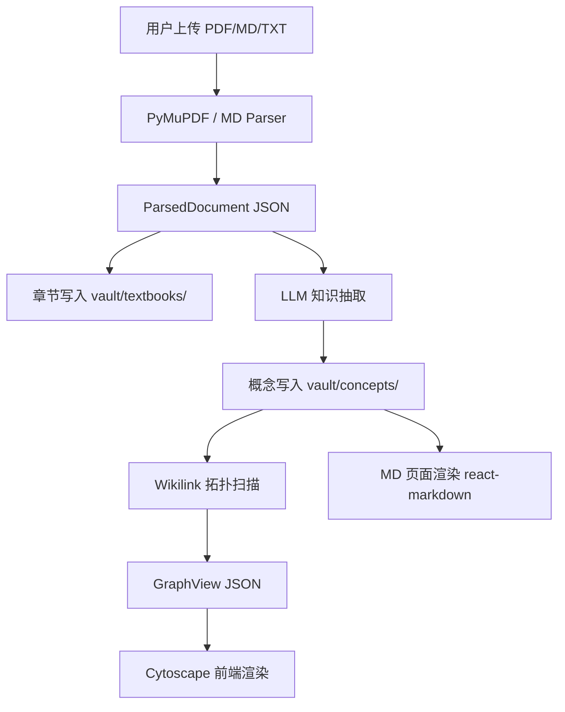

# 系统设计 — LLM Wiki Approach

## 核心理念：万物皆MD

本系统采用 Obsidian-flavored Markdown 作为知识的单一事实来源（Single Source of Truth）。知识图谱不作为独立数据结构存储，而是从 vault 中 `[[wikilinks]]` 的拓扑结构实时派生。

## 架构总览



## 技术栈

| 层 | 技术 |
|---|---|
| 前端框架 | React 19 + TypeScript + Vite 7 |
| 图谱可视化 | Cytoscape.js + fcose layout |
| MD 渲染 | react-markdown + remark-gfm |
| 后端框架 | FastAPI (Python 3.11+) |
| 文档解析 | PyMuPDF (PDF), 自定义 MD/TXT parser |
| LLM 集成 | OpenAI-compatible HTTP API (httpx) |
| 存储 | 文件系统（JSON + Markdown） |
| 包管理 | pip (requirements.txt) + npm (package.json) |

## 数据流

### 上传 → 解析 → Vault 写入

```
1. 用户上传文件 (POST /api/documents/upload)
2. 根据文件后缀选择 Parser (PDF/MD/TXT)
3. 解析为 ParsedDocument (chapters[] + metadata)
4. 保存 document JSON 到 data/runtime/documents/{id}/
5. 章节写入 data/vault/textbooks/{title}/{chapter}.md
```

### 知识抽取 → 概念文件

```
1. 用户触发提取 (POST /api/extraction/run)
2. 对每个章节调用 LLM，提取 8-15 个知识点
3. LLM 返回 JSON: {concepts: [{name, definition, relations, evidence}]}
4. 同名概念写入同一个 MD 文件: vault/concepts/{safe_name}.md
   - 若文件不存在：创建新概念页，id = concept_{safe_name}
   - 若文件已存在：按 AGENTS.md 的 Concept Vault Schema 做 parse-time merge
   - YAML frontmatter: id, category, aliases, sources
   - Body: canonical/候选定义, ## 关系 (typed [[wikilinks]]), 来源证据
5. 解析期只做 lossless merge；定义提纯与整合决策交给后续 content-merge worker
```

### 图谱派生 → 前端渲染

```
1. 前端请求图谱 (GET /api/graph)
2. GraphBuilder 扫描 vault/concepts/ 所有 .md 文件
3. 每个文件 = 一个节点 (从 frontmatter 读取 id/category)
4. 解析 ## 关系 section 中的 "- {类型}: [[target]]" → 边
5. 只保留 target 文件存在的边（忽略悬挂链接）
6. 返回 GraphView JSON → Cytoscape 渲染
```

## 模块结构

```
src/backend/
├── main.py                    FastAPI 路由
└── app/
    ├── core/config.py         .env 配置
    ├── parsers/
    │   ├── base.py            ParsedDocument/ParsedChapter 数据类
    │   ├── pdf.py             三级联级章节检测 (bookmarks > TOC > regex)
    │   └── markdown.py        Heading-based 章节划分
    ├── services/
    │   ├── llm.py             OpenAI-compatible LLM adapter
    │   ├── vault.py           Vault CRUD + frontmatter + wikilink 扫描
    │   ├── concept_writer.py  LLM 输出 → 概念 MD 文件
    │   └── graph_builder.py   Vault → GraphView 派生
    └── storage/
        └── repository.py      文档元数据持久化 (JSON)
```

## 存储策略

```
data/
├── runtime/                   传统 JSON 元数据（文档注册、job 状态）
│   ├── documents/{id}/
│   │   ├── document.json
│   │   └── meta.json
│   └── jobs/
└── vault/                     Obsidian-compatible vault（核心知识库）
    ├── textbooks/{title}/     原文章节 MD
    │   ├── _meta.md
    │   └── {chapter}.md
    └── concepts/              知识点页面（图谱节点）
        ├── 炎症.md
        ├── 细胞损伤.md
        └── ...
```

## 关键设计决策

### 为什么图谱是派生的而不是存储的？

1. **一致性**：MD 文件即真相，无需同步两套数据
2. **可编辑性**：直接在 Obsidian 中编辑概念文件，图谱自动更新
3. **可审计性**：每个知识点是人类可读的 MD，方便 debug
4. **Git 友好**：纯文本 diff，版本控制简单

### 为什么用 YAML frontmatter 而不是 JSON？

1. Obsidian 原生支持 YAML frontmatter
2. 比内嵌 JSON 更易读
3. 与 Jekyll/Hugo/Quartz 等静态站点生成器兼容

### 为什么关系写在 markdown body 而不是 frontmatter？

1. `[[wikilinks]]` 是 Obsidian graph view 的原生数据源
2. body 中的 `## 关系` section 同时服务于人类阅读和机器解析
3. 保持 frontmatter 简洁（只放结构化元数据）
